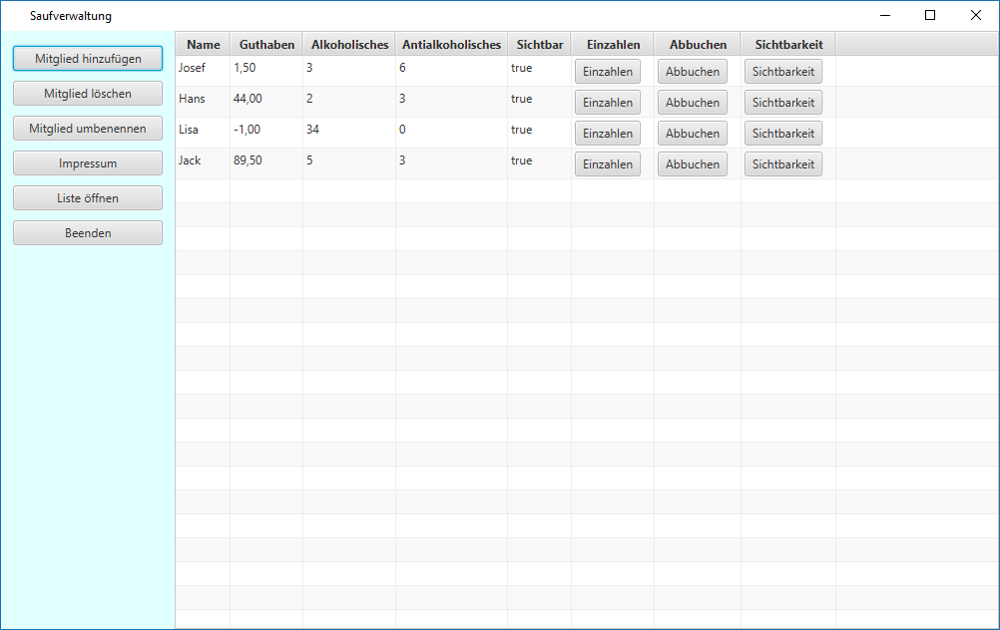

# Saufverwaltung2

Enterprise application to organize the sale of beverages in a club setting. Members can deposit credits in the form of cash, and withdraw in the form of drinks. The application keeps track of each user's credits and drinking behaviour.

## Features

- Adding/deleting/renaming users.
- Deposit and withdrawal of funds, the latter only by purchasing beverages. Currently there are two types of beverage (alcoholic, antialcoholic).
- Viewing information on how much drinks each user has consumed.
- Localization in german and english, however english localization can currently only be enabled via a command line parameter. Adding a GUI element for changing the localization would be a *great* contribution to this project.
- **Main feature:** Output of a list containing each user's credits ("Strichliste") to a file for print. Users can add strikes for drinks they have consumed, which can be put into the application later. This is handy for a club environment, in which users want to drink and pay by adding a strike onto their list. It is also the reason for most productive use of this application, see [Business partners](#business-partners)

## Screenshot



Note that the german localization is used in the screenshot. 

The data displayed in the screenshot would produce the following printable text file: 

```
Strichliste                                                        05.12.2018

Name:    | Alkoholisches (1,50€)      | Antialkoholisches (1€)     | Kapital 
---------+----------------------------+----------------------------+---------
Jack     |                            |                            |   89,50€
---------+----------------------------+----------------------------+---------
Lisa     | GESPERRT                   | GESPERRT                   |   -1,00€
---------+----------------------------+----------------------------+---------
Hans     |                            |                            |   44,00€
---------+----------------------------+----------------------------+---------
Josef    |                            |                            |    1,50€
---------+----------------------------+----------------------------+---------

```

## Business partners

This application is currently in (more or less) productive use by the [Verein zur Förderung der offenen Jugendarbeit Blaubeuren e.V.](https://www.facebook.com/JuHaBlb/), which is a german non-profit organization.

